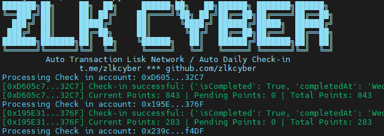

# LISK PORTAL



**The L2 for Real World Solutions in Emerging Markets**
Lisk Portal is the gateway to the Lisk ecosystem, providing access to a cost-efficient and scalable L2 network secured by Ethereum and part of the OP Superchain.

## Description

- Register here : https://portal.lisk.com/airdrop
- Register with wallet and follow instructions there
- Submit Code
  ```
  OUrd4I
  ```
- Deposit to LISK MAINNET, just not too much to paying gas fee
- Bridge here: https://superbridge.app/lisk-mainnet
- The Script will do 75 onchain tx each day so we can get max points each week [500 points].

## Instalation

```bash
git clone https://github.com/Zlkcyber/liskportal.git
cd liskportal
```

install the packages

```bash
pip install -r requirements.txt
```

**Edit pvkey.txt and input Private Key**

```bash
nano pvkeys.txt
```

run the script

```bash
python3 main.py
```

## 

This project is licensed under the [MIT License](LICENSE).
